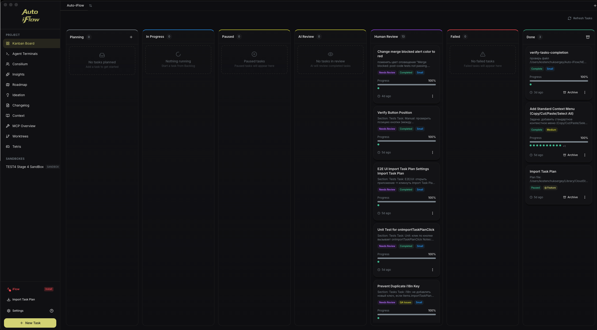
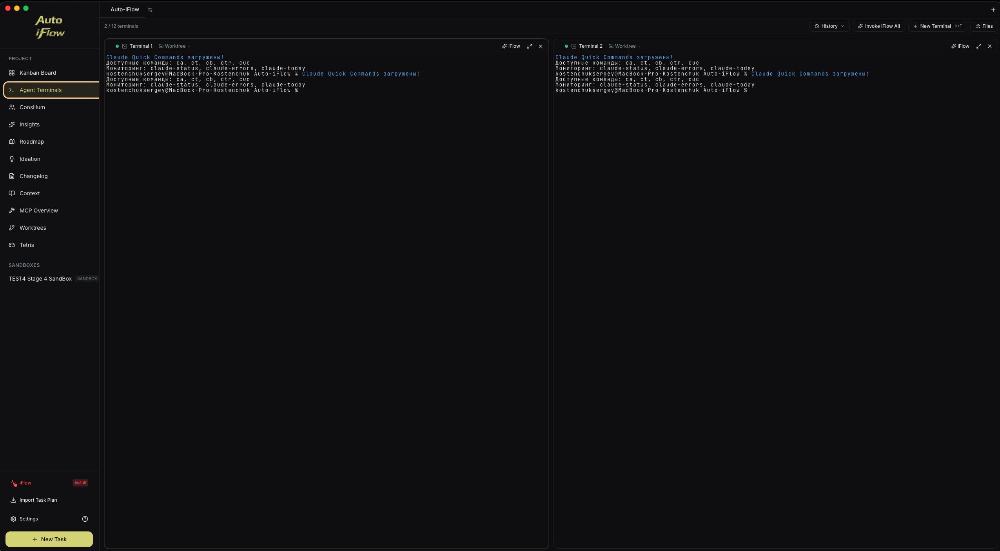
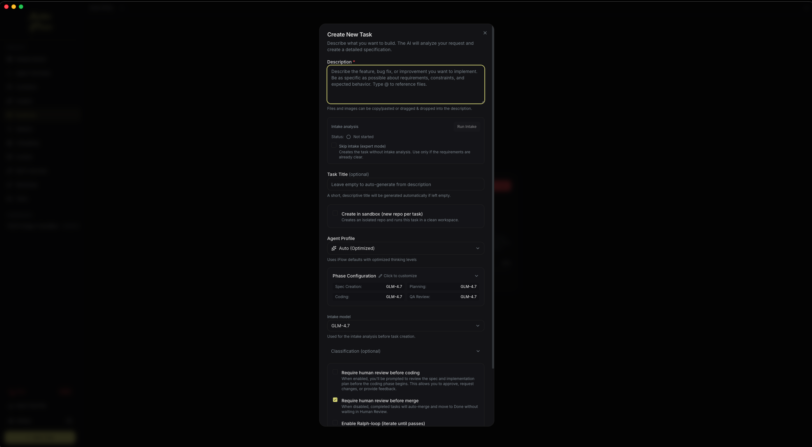
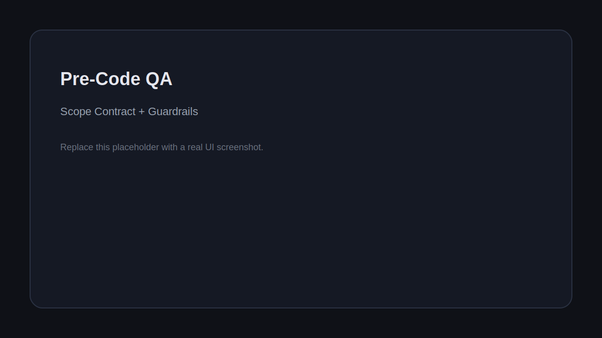
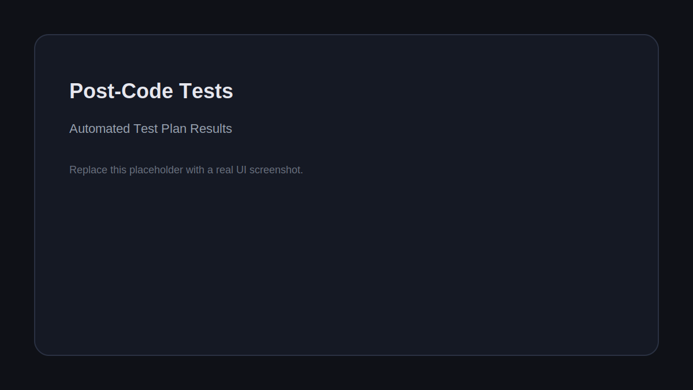

# Auto-iFlow

**Autonomous multi-agent coding framework that plans, builds, and validates software for you.**



[](./agpl-3.0.txt)
[](https://t.me/auto_iflow)
[](https://www.threads.net/@sergekost)
[](https://www.youtube.com/@AndreMikalsen)
[](https://github.com/sergekostenchuk/Auto-iFlow/actions)

---

**Presentation (Matrix Codex)**:
- [EN](docs/presentation/Matrix-Codex-PRESENTATION-AUTO-IFLOW-en.html)
- [RU](docs/presentation/Matrix-Codex-PRESENTATION-AUTO-IFLOW-ru.html)
- [FR](docs/presentation/Matrix-Codex-PRESENTATION-AUTO-IFLOW-fr.html)
- [ES](docs/presentation/Matrix-Codex-PRESENTATION-AUTO-IFLOW-es.html)

**Documentation (Matrix Codex Deep Dive)**:
- [EN](docs/presentation/Matrix-Codex-DOCS-PRESENTATION-AUTO-IFLOW-en.html)
- [RU](docs/presentation/Matrix-Codex-DOCS-PRESENTATION-AUTO-IFLOW-ru.html)
- [FR](docs/presentation/Matrix-Codex-DOCS-PRESENTATION-AUTO-IFLOW-fr.html)
- [ES](docs/presentation/Matrix-Codex-DOCS-PRESENTATION-AUTO-IFLOW-es.html)

**Task Plan Importer**:
- [Format & Guide](docs/auto-iflow/TASK-PLAN-IMPORTER.md)

---

## Attribution

Auto‑iFlow is derived from and builds upon ideas and parts of the **Auto‑Claude** project.  
Original project: https://github.com/AndyMik90/Auto-Claude

---

## Download

### Stable Release

<!-- STABLE_VERSION_BADGE -->
[](https://github.com/sergekostenchuk/Auto-iFlow-3.1.1-code/releases/tag/v3.1.1)
<!-- STABLE_VERSION_BADGE_END -->

<!-- STABLE_DOWNLOADS -->
| Version | Download |
|---------|----------|
| **3.1.1** | [View release assets](https://github.com/sergekostenchuk/Auto-iFlow-3.1.1-code/releases/tag/v3.1.1) |
<!-- STABLE_DOWNLOADS_END -->

> All releases include SHA256 checksums and VirusTotal scan results for security verification.

---

## Requirements

- **Claude Pro/Max subscription** - [Get one here](https://claude.ai/upgrade)
- **Claude Code CLI** - `npm install -g @anthropic-ai/claude-code`
- **Git repository** - Your project must be initialized as a git repo

---

## Quick Start

1. **Download and install** the app for your platform
2. **Open your project** - Select a git repository folder
3. **Connect Claude** - The app will guide you through OAuth setup
4. **Create a task** - Describe what you want to build
5. **Watch it work** - Agents plan, code, and validate autonomously

---

## Features

| Feature | Description |
|---------|-------------|
| **Autonomous Tasks** | Describe your goal; agents handle planning, implementation, and validation |
| **Parallel Execution** | Run multiple builds simultaneously with up to 12 agent terminals |
| **Isolated Workspaces** | All changes happen in git worktrees - your main branch stays safe |
| **Self-Validating QA** | Built-in quality assurance loop catches issues before you review |
| **Pre-Code QA Guardrails** | Scope contract + senior review keep changes in the right place |
| **Post-Code Tests** | Test plan runs automatically and blocks human review on failures |
| **AI-Powered Merge** | Automatic conflict resolution when integrating back to main |
| **Memory Layer** | Agents retain insights across sessions for smarter builds |
| **GitHub/GitLab Integration** | Import issues, investigate with AI, create merge requests |
| **Linear Integration** | Sync tasks with Linear for team progress tracking |
| **Cross-Platform** | Native desktop apps for Windows, macOS, and Linux |
| **Auto-Updates** | App updates automatically when new versions are released |

---

## Interface

### Kanban Board
Visual task management from planning through completion. Create tasks and monitor agent progress in real-time.

### Agent Terminals
AI-powered terminals with one-click task context injection. Spawn multiple agents for parallel work.



### Smart Intake
Smart Intake evaluates whether a task is implementation-ready, identifies real blockers, runs targeted clarification rounds, and unlocks task creation only when scope is actionable.



### Quality Guardrails
Pre-code scope checks and post-code tests are visible inside each task.





### Additional Features
- **Insights** - Chat interface for exploring your codebase
- **Ideation** - Discover improvements, performance issues, and vulnerabilities
- **Changelog** - Generate release notes from completed tasks

---

## Project Structure

```
Auto-iFlow/
├── apps/
│   ├── backend/     # Python agents, specs, QA pipeline
│   └── frontend/    # Electron desktop application
├── guides/          # Additional documentation
├── tests/           # Test suite
└── scripts/         # Build utilities
```

---

## Submodules

This repo includes the `TESTS-AUTO-IFLOW/auto-iflow-test` submodule.

```bash
git submodule init
git submodule update --recursive
```

---

## CLI Usage

For headless operation, CI/CD integration, or terminal-only workflows:

```bash
cd apps/backend

# Create a spec interactively
python spec_runner.py --interactive

# Run autonomous build
python run.py --spec 001

# Review and merge
python run.py --spec 001 --review
python run.py --spec 001 --merge
```

See [guides/CLI-USAGE.md](guides/CLI-USAGE.md) for complete CLI documentation.

---

## Development

Want to build from source or contribute? See [CONTRIBUTING.md](CONTRIBUTING.md) for complete development setup instructions.

For Linux-specific builds (Flatpak, AppImage), see [guides/linux.md](guides/linux.md).

---

## Security

Auto-iFlow uses a three-layer security model:

1. **OS Sandbox** - Bash commands run in isolation
2. **Filesystem Restrictions** - Operations limited to project directory
3. **Dynamic Command Allowlist** - Only approved commands based on detected project stack

All releases are:
- Scanned with VirusTotal before publishing
- Include SHA256 checksums for verification
- Code-signed where applicable (macOS)

---

## Available Scripts

| Command | Description |
|---------|-------------|
| `npm run install:all` | Install backend and frontend dependencies |
| `npm start` | Build and run the desktop app |
| `npm run dev` | Run in development mode with hot reload |
| `npm run package` | Package for current platform |
| `npm run package:mac` | Package for macOS |
| `npm run package:win` | Package for Windows |
| `npm run package:linux` | Package for Linux |
| `npm run package:flatpak` | Package as Flatpak (see [guides/linux.md](guides/linux.md)) |
| `npm run lint` | Run linter |
| `npm test` | Run frontend tests |
| `npm run test:backend` | Run backend tests |

---

## Contributing

We welcome contributions! Please read [CONTRIBUTING.md](CONTRIBUTING.md) for:
- Development setup instructions
- Code style guidelines
- Testing requirements
- Pull request process

---

## Community

- **Telegram** - [@auto_iflow](https://t.me/auto_iflow)
- **Threads** - [@sergekost](https://www.threads.net/@sergekost)
- **Issues** - [Report bugs or request features](https://github.com/sergekostenchuk/Auto-iFlow/issues)
- **Discussions** - [Ask questions](https://github.com/sergekostenchuk/Auto-iFlow/discussions)

---

## License

**AGPL-3.0** - GNU Affero General Public License v3.0

Auto-iFlow is free to use. If you modify and distribute it, or run it as a service, your code must also be open source under AGPL-3.0.

Commercial licensing available for closed-source use cases.

---

## Star History

[](https://github.com/sergekostenchuk/Auto-iFlow/stargazers)

[](https://star-history.com/#sergekostenchuk/Auto-iFlow&Date)
